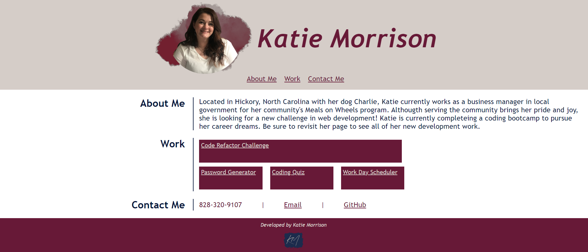

# My portfolio README

## User Story

As An employer, I want to view a potential employee's deployed portfolio of work samples, so that I can review samples of their work and assess whether they're a good candidate for an open position

## Acceptance Cristeria

Given I need to sample a potential employee's previous work

- When I load their portfolio, I am presented with the developer's name, a recent photo or avatar, and links to sections about them, their work, and how to contact them

- When I click one of the links in the navigatiom, the UI scrolls to the corresponding section

- WHEN I click on the link to the section about their work, the UI scrolls to a section with titled images of the developer's applications

- When I am presented with the developer's first applicatiom, that application's image should be larger in size than the others

- When I click on the images of the applications, I am taken to that deployed application

- When I resize the page or view the site on various screens and devices, I am presented with a responsive layout that adapts to my viewport

[Portfolio Link]

